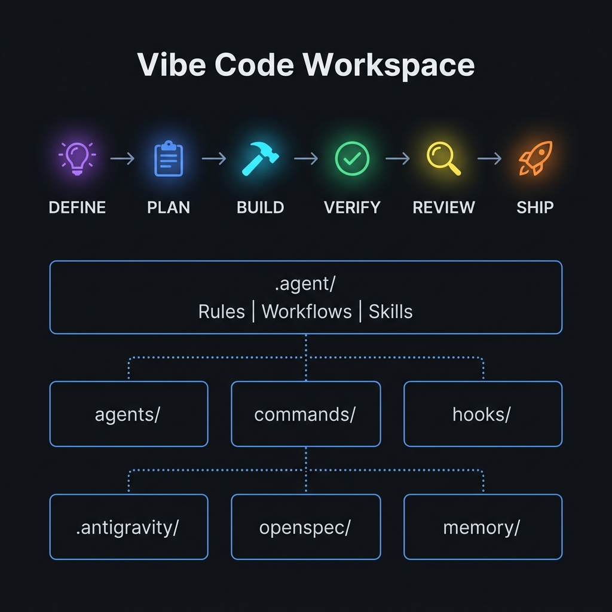
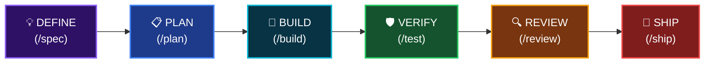

<div align="center">


# Antigravity Awesome Workspace

### 终极 AI 驱动的 Vibe Code 模板

**51 个 AI 代理 · 79 个斜杠命令 · 26 个核心技能 · 1500+ 技能库 · 25 个 MCP 服务器**

语言: [English](README.md) | [Tiếng Việt](README_VI.md) | **简体中文** | [Español](README_ES.md)

[](LICENSE)
[](https://python.org/)

<br/>


</div>

---

> **融合了 4 个世界顶级 Vibe Code 系统的精华**，整合为一个生产就绪的工作区模板。只需一条命令 `python init_vibe_project.py my-app` 即可获得一切。

<br/>

## 🎯 这是什么？

这是最全面的 **AI 代理编程工作区模板** —— 一个为您提供构建软件所需一切的生产就绪脚手架。

一条命令。所有 IDE 均可使用。包含所有技能。无供应商锁定（Zero lock-in）。

```bash
python init_vibe_project.py my-app
# → 26 core skills, 51 agents, 79 commands, 25 MCP servers, Docker, CI/CD, OpenSpec... 瞬间完成。
```

---

## 🚀 快速开始

### 选项 A — 创建新项目（推荐）

```bash
# 克隆此模板
git clone https://github.com/your-org/antigravity-awesome-workspace-skill.git
cd antigravity-awesome-workspace-skill

# 初始化包含完整 Vibe Code 套件的项目
python init_vibe_project.py my-awesome-app
```

```
🚀 Initializing Ultimate Vibe Code Workspace at: /path/to/my-awesome-app

[*] Copied directory .antigravity/
[*] Copied directory .agent/
[*] Copied directory agents/
[*] Copied directory commands/
...
[+] 🎉 Project initialized successfully!

=================================================================
💡 NEXT STEPS:
  1. cd my-awesome-app
  2. cp .env.example .env  (then fill in your API keys)
  3. Open in Cursor / Windsurf / Claude Code / Antigravity
  4. Pre-installed components:
     ✅ 26 Core Skills + 1500+ in Skill Library
     ✅ 51 AI Personas (Architect, Reviewer, Security, QA...)
     ✅ 79 Slash Commands (/plan, /tdd, /code-review, /ship...)
     ✅ 25+ MCP Servers (DB, GitHub, Jira, Playwright, Vercel...)
     ✅ Karpathy Guidelines (Think → Simplify → Surgical → Goal-Driven)
     ...
=================================================================
```

### 选项 B — 添加到现有项目

将特定目录复制到您的项目中：

```bash
# 仅复制核心技能框架
cp -r .agent/ /your-project/.agent/
cp AGENTS.md /your-project/
cp .cursorrules /your-project/

# 或者复制所有内容
cp -r agents/ commands/ hooks/ references/ /your-project/
```

---

## 📐 架构

<div align="center">

</div>

### 开发生命周期 (Development Lifecycle)



每个阶段都有会自动激活的**专属技能、代理和命令**。

---

## 📦 包含内容

### 🤖 AI 代理 (51 个专家角色)

专家角色拥有专门的视角。每个代理都会被您的 IDE 自动发现。

| 类别 | 代理角色 (Agents) | 目的 |
|----------|--------|---------|
| **架构** | `architect`, `planner`, `chief-of-staff` | 系统设计、规划、协调 |
| **代码审查** | `code-reviewer`, `typescript-reviewer`, `python-reviewer`, `go-reviewer`, `rust-reviewer`, `kotlin-reviewer`, `java-reviewer`, `csharp-reviewer`, `cpp-reviewer`, `flutter-reviewer` | 特定语言代码审查 |
| **安全** | `security-auditor`, `security-reviewer`, `healthcare-reviewer` | 漏洞检测、合规审计 |
| **测试** | `test-engineer`, `tdd-guide`, `e2e-runner`, `pr-test-analyzer` | 测试策略、覆盖率、E2E 测试 |
| **构建修复** | `build-error-resolver`, `go-build-resolver`, `rust-build-resolver`, `kotlin-build-resolver`, `cpp-build-resolver`, `java-build-resolver`, `dart-build-resolver`, `pytorch-build-resolver` | 自动修复特定语言的构建错误 |
| **性能** | `performance-optimizer`, `harness-optimizer` | 性能分析与优化 |
| **文档** | `doc-updater`, `docs-lookup`, `seo-specialist` | 编写文档、API 查找、SEO |
| **AI/ML** | `gan-planner`, `gan-generator`, `gan-evaluator` | GAN 架构与训练 |
| **开源** | `opensource-forker`, `opensource-packager`, `opensource-sanitizer` | Fork、打包、清理开源项目 |
| **代码分析** | `code-architect`, `code-explorer`, `code-simplifier`, `comment-analyzer`, `conversation-analyzer`, `type-design-analyzer`, `silent-failure-hunter`, `refactor-cleaner` | 深入代码分析 |
| **运维** | `loop-operator`, `a11y-architect`, `database-reviewer` | 自动化循环、无障碍、数据库 |

---

## ⚡ 命令速查表 (Commands)

> 总计 79 个斜杠命令。在任何会话中输入 `/` 即可调用。

| 类别 | 命令 |
|----------|----------|
| **核心工作流** | `/plan`, `/tdd`, `/code-review`, `/build-fix`, `/verify`, `/quality-gate` |
| **测试** | `/tdd`, `/e2e`, `/test-coverage`, `/go-test`, `/kotlin-test`, `/rust-test`, `/cpp-test`, `/flutter-test` |
| **代码审查** | `/code-review`, `/python-review`, `/go-review`, `/kotlin-review`, `/rust-review`, `/cpp-review`, `/flutter-review` |
| **构建修复** | `/build-fix`, `/go-build`, `/kotlin-build`, `/rust-build`, `/cpp-build`, `/gradle-build`, `/flutter-build` |
| **规划执行** | `/plan`, `/multi-plan`, `/multi-workflow`, `/multi-backend`, `/multi-frontend`, `/multi-execute`, `/orchestrate`, `/devfleet` |
| **会话状态** | `/save-session`, `/resume-session`, `/sessions`, `/checkpoint`, `/aside`, `/context-budget` |
| **学习进化** | `/learn`, `/learn-eval`, `/evolve`, `/promote`, `/instinct-status`, `/instinct-export`, `/instinct-import`, `/skill-create`, `/skill-health`, `/rules-distill` |
| **文档** | `/docs`, `/update-docs`, `/update-codemaps` |
| **自动化** | `/loop-start`, `/loop-status`, `/claw` |

📋 完整参考: [COMMANDS-QUICK-REF.md](COMMANDS-QUICK-REF.md)

---

## 🔌 MCP 服务器 (25 个预配置)

为最大限度的灵活性提供两个 MCP 配置文件：

### `mcp_servers.json` — 核心基础设施
| 服务器 | 用途 |
|--------|---------|
| **PostgreSQL** | 数据库操作 |
| **GitHub** | PR, issues, repos |
| **Puppeteer** | 浏览器自动化 |
| **GitNexus** | 代码依赖图分析 |

### `mcp-configs/mcp-servers.json` — 扩展目录
| 服务器 | 用途 |
|--------|---------|
| **Jira** | 追踪 Issue |
| **Supabase** | DB + 认证 |
| **Playwright** | 浏览器端测试 |
| **Context7** | 实时文档查询 |
| **Vercel** | 自动部署 |
| **Railway** | 自动部署 |
| **Cloudflare** | Docs, Workers, Observability |
| **ClickHouse** | 数据分析查询 |
| **Exa Search** | 网页搜索研究 |
| **Memory** | 跨会话持久记忆 |
| **Sequential Thinking** | 思维链 (Chain-of-thought) |
| **Magic UI** | UI 组件库 |

---

## 📖 技能库 (Skill Library - 1500+)

`skill_library/` 目录包含从所有源代码存储库提取的**完整技能目录**。这些技能默认不加载，而是作为按需取用的资源库。

**如何使用:**

```bash
# 查看可用技能
ls skill_library/

# 将需要的技能复制到项目中
cp -r skill_library/some-skill/ my-project/.agent/skills/
```

**分类包括:** DevOps、机器学习、移动端 (Flutter/React Native)、游戏开发 (Unity/Unreal)、CMS (WordPress/Shopify)、云服务 (AWS/GCP/Azure)、区块链/Web3、数据科学以及 50 多个其他领域。

---

## 🛡️ 安全

此模板包含全面的安全基础设施：

- **Security Auditor Agent** — OWASP 漏洞检测
- **Security Checklist** — 生产就绪的安全审计检查清单
- **The Security Guide** — 关于代理安全性的 29KB 深入解析 (CVE、沙箱、提示注入)
- **Docker Sandbox** — 隔离的代码执行环境
- **`.env.example`** — 绝不硬编码密码及密钥

📖 进一步阅读: [docs/the-security-guide.md](docs/the-security-guide.md)

---

## 🏗️ 多 IDE 支持 (Multi-IDE)

此模板兼容所有主流 AI 编程 IDE：

| IDE | 配置文件 | 工作原理 |
|-----|------------|--------------|
| **Antigravity** | `.agent/` | 原生 `.agent/rules/`, `.agent/skills/`, `.agent/workflows/` |
| **Claude Code** | `CLAUDE.md`, `.claude/` | 命令、代理、钩子、插件 |
| **Cursor** | `.cursorrules` | 通过光标配置注入的规则 |
| **Gemini CLI** | `.gemini/GEMINI.md` | 原生 Gemini 指令 |
| **Kiro** | `.kiro/` | 原生 Kiro 技能 |
| **Codex** | `AGENTS.md` | 代理定义 |
| **Windsurf** | `.cursorrules` | 兼容 Cursor 的格式 |
| **OpenCode** | `.opencode/` | OpenCode 插件 |

---

## 📚 参考文献与灵感

此模板受到 AI 编程社区中以下优秀的开源项目的启发，并引用了这些项目：

<table>
<tr>
<td align="center" width="120">
<a href="https://github.com/affaan-m/everything-claude-code">

</a>
</td>
<td>

**[Everything Claude Code](https://github.com/affaan-m/everything-claude-code)** — AI 代理性能优化系统。47 个代理，181 项技能，79 个命令，钩子，MCP 配置。Anthropic 黑客马拉松冠军。

</td>
</tr>
<tr>
<td align="center" width="120">
<a href="https://github.com/addyosmani/agent-skills">

</a>
</td>
<td>

**[Agent Skills](https://github.com/addyosmani/agent-skills)** — 由 Addy Osmani (Google) 提供的生产级工程技能。“过程重于散文”的理念、生命周期、编排模式。

</td>
</tr>
<tr>
<td align="center" width="120">
<a href="https://github.com/forrestchang/andrej-karpathy-skills">

</a>
</td>
<td>

**[Karpathy Skills](https://github.com/forrestchang/andrej-karpathy-skills)** — 基于 Andrej Karpathy 观察到的 LLM 编程陷阱的行为准则：先思考再编码、简单至上、精确修改、目标驱动执行。

</td>
</tr>
<tr>
<td align="center" width="120">
<a href="https://github.com/study8677/antigravity-workspace-template">

</a>
</td>
<td>

**[Antigravity Workspace Template](https://github.com/study8677/antigravity-workspace-template)** — 多代理知识引擎。Swarm 协议、OpenSpec 框架。

</td>
</tr>
</table>

> 所有引用的项目均遵循 MIT 或 Apache 2.0 许可证。本项目遵循 MIT 许可证。

---

## 🤝 贡献指南

我们非常欢迎您的贡献！以下是参与方式：

1. **Fork** 本仓库
2. **创建** 您的功能分支 (`git checkout -b feature/amazing-skill`)
3. **添加** 您的技能到 `.agent/skills/` 或是 `skill_library/`
4. **遵守** [技能开发指南](docs/SKILL-DEVELOPMENT-GUIDE.md)
5. **提交** 您的 Pull Request

---

## 📄 许可证

本项目基于 **MIT 许可证** 授权 — 详见 [LICENSE](LICENSE) 获取完整信息。

所有集成的组件均保留其从各自源代码存储库继承的原始 MIT 许可证。

---

<div align="center">

**Made by [Hai-Dang Nguyen](https://nguyenhaidang.io.vn/)** · PhD Student, College of Engineering & Computer Science, [VinUniversity](https://vinuni.edu.vn/)

[](https://nguyenhaidang.io.vn/)
[](https://github.com/dangindev)

<sub>如果您在项目中使用此模板，请考虑将此徽章添加到您的 README 中：</sub>

```markdown
[](https://github.com/dangindev/antigravity-awesome-workspace-skill)
```

<br/>

[](https://github.com/dangindev/antigravity-awesome-workspace-skill)

</div>
