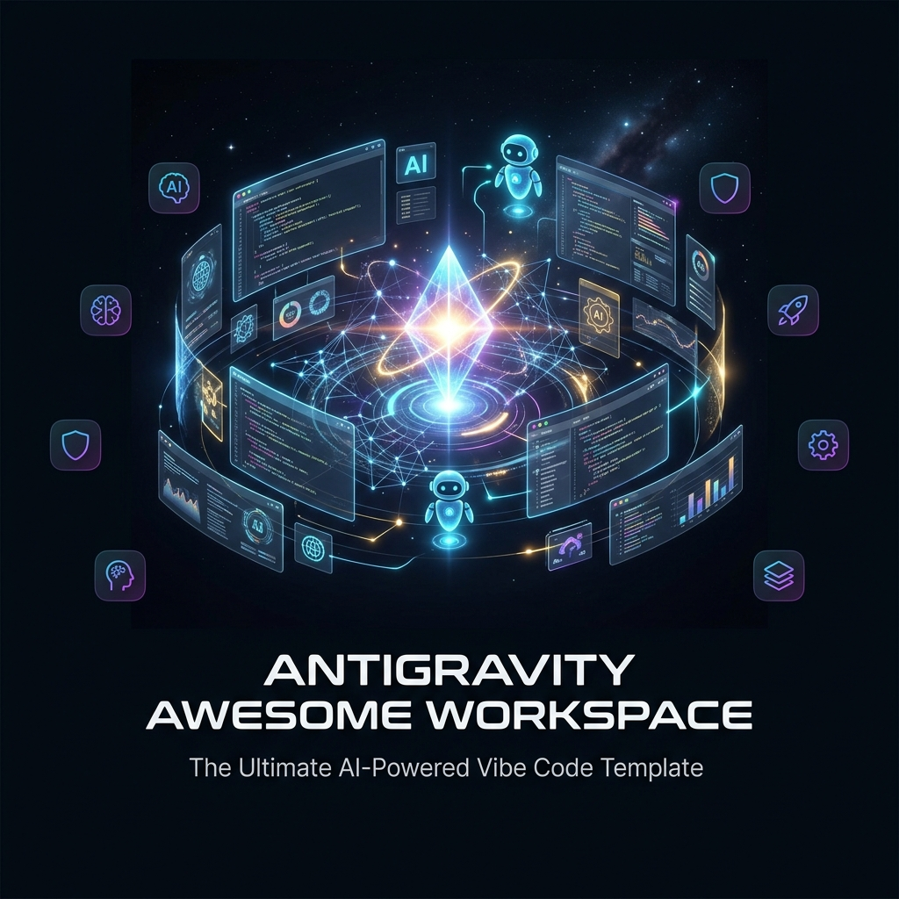

<div align="center">



# Antigravity Awesome Workspace

### 终极 AI 驱动的 Vibe Code 模板

**51 个 AI 代理 · 79 个斜杠命令 · 25 个核心技能 · 1500+ 技能库 · 25 个 MCP 服务器**

语言: [English](README.md) | [Tiếng Việt](README_VI.md) | **简体中文** | [Español](README_ES.md)

[](LICENSE)
[](https://python.org/)

</div>

---

> **融合了 4 个世界顶级 Vibe Code 系统的精华**，整合为一个即开即用的工作区模板。只需运行 `python init_vibe_project.py my-app` 即可获得一切。

## 🎯 这是什么？

这是有史以来最全面的 **AI 代理编程工作区模板**。它融合了以下系统的精华：

| 来源 | 提取内容 | Stars |
|------|---------|-------|
| [Agent Skills](https://github.com/addyosmani/agent-skills) | 工程流程技能、角色、编排模式 | 30K+ |
| [Everything Claude Code](https://github.com/AffaanMustafa/everything-claude-code) | 79 个命令、48 个代理、钩子、MCP、安全指南 | 140K+ |
| [Antigravity Awesome Skills](https://github.com/dangindev/antigravity-awesome-skills) | 1400+ 领域专用技能 | — |
| [Antigravity Workspace Template](https://github.com/study8677/antigravity-workspace-template) | 记忆引擎、知识中心、OpenSpec、Swarm 协议 | — |

---

## 🚀 快速开始

```bash
# 克隆模板
git clone https://github.com/your-org/antigravity-awesome-workspace-skill.git
cd antigravity-awesome-workspace-skill

# 创建新项目
python init_vibe_project.py my-awesome-app

# 然后
cd my-awesome-app
cp .env.example .env    # 填写 API 密钥
# 打开 IDE（Cursor / Windsurf / Claude Code / Antigravity）开始编码！
```

---

## 📦 包含内容

### 核心框架（`.agent/`）
- **28 个规则文件**，覆盖 15 种编程语言
- **9 个工作流**（特性规划、代码审查、数据库设计、测试生成、安全重构、发布准备、OpenSpec）
- **25 个核心技能**（TDD、规范驱动、安全、CI/CD、架构、调试等）

### AI 代理（51 个专家角色）
- **架构师**：`architect`、`planner`、`chief-of-staff`
- **代码审查员**：10 种语言专用审查员
- **安全专家**：`security-auditor`、`security-reviewer`
- **测试工程师**：`test-engineer`、`tdd-guide`、`e2e-runner`
- **构建修复器**：8 种语言构建错误修复
- **性能、SEO、无障碍、数据库、AI/ML、开源...**

### 79 个斜杠命令
| 类别 | 命令 |
|------|------|
| 核心工作流 | `/plan`、`/tdd`、`/code-review`、`/build-fix`、`/verify` |
| 测试 | `/e2e`、`/test-coverage`、`/go-test`、`/rust-test` |
| 会话管理 | `/save-session`、`/resume-session`、`/checkpoint` |
| 学习 | `/learn`、`/evolve`、`/skill-create` |
| 多模型 | `/multi-plan`、`/multi-execute`、`/orchestrate` |

### 25+ MCP 服务器
PostgreSQL、GitHub、Jira、Supabase、Playwright、Context7、Vercel、Railway、Cloudflare、ClickHouse 等。

### 文档（24 个文件）
架构哲学、Swarm 协议、零配置、安全指南（29KB）、IDE 设置指南、技能开发指南。

### 基础设施
Docker（生产 + 沙盒）、GitHub Actions CI/CD、OpenSpec、记忆引擎、多 IDE 支持。

### 技能库（1500+）
`skill_library/` 目录包含所有技能的完整目录。按需复制到 `.agent/skills/`。

---

## 📄 许可证

MIT 许可证 — 详见 [LICENSE](LICENSE)。

<div align="center">

**用 ❤️ 为 AI 驱动的开发者社区构建**

</div>
