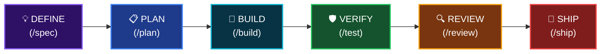

<div align="center">


# Antigravity Awesome Workspace

### 终极 AI 驱动的 Vibe Code 模板

**51 个 AI 代理 · 79 个斜杠命令 · 26 个核心技能 · 1500+ 技能库 · 25 个 MCP 服务器**

语言: [English](README.md) | [Tiếng Việt](README_VI.md) | **简体中文** | [Español](README_ES.md)

[](LICENSE)
[](https://python.org/)

</div>

---

> **融合了 4 个世界顶级 Vibe Code 系统的精华**，整合为一个即开即用的工作区模板。只需运行 `python init_vibe_project.py my-app` 即可获得一切。

## 🎯 这是什么？

这是最全面的 **AI 代理编程工作区模板** —— 一个为您提供构建软件所需一切的生产就绪脚手架。

只需一条命令。支持所有 IDE。包含所有技能。无供应商锁定。

```bash
python init_vibe_project.py my-app
# → 26 core skills, 51 agents, 79 commands, 25 MCP servers, Docker, CI/CD, OpenSpec... 瞬间完成。
```

---

## 📚 参考文献与灵感

此模板受到 AI 编程社区中以下优秀的开源项目的启发，并引用了这些项目：

<table>
<tr>
<td align="center" width="120">
<a href="https://github.com/AffaanMustafa/everything-claude-code">

</a>
</td>
<td>

**[Everything Claude Code](https://github.com/AffaanMustafa/everything-claude-code)** — AI 代理性能优化系统。47 个代理，181 项技能，79 个命令，钩子，MCP 配置。Anthropic 黑客马拉松冠军。

</td>
</tr>
<tr>
<td align="center" width="120">
<a href="https://github.com/addyosmani/agent-skills">

</a>
</td>
<td>

**[Agent Skills](https://github.com/addyosmani/agent-skills)** — 由 Addy Osmani (Google) 提供的生产级工程技能。“过程重于散文”的理念、生命周期、编排模式。

</td>
</tr>
<tr>
<td align="center" width="120">
<a href="https://github.com/forrestchang/andrej-karpathy-skills">

</a>
</td>
<td>

**[Karpathy Skills](https://github.com/forrestchang/andrej-karpathy-skills)** — 基于 Andrej Karpathy 观察到的 LLM 编程陷阱的行为准则：先思考再编码、简单至上、精确修改、目标驱动执行。

</td>
</tr>
<tr>
<td align="center" width="120">
<a href="https://github.com/study8677/antigravity-workspace-template">

</a>
</td>
<td>

**[Antigravity Workspace Template](https://github.com/study8677/antigravity-workspace-template)** — 多代理知识引擎。Swarm 协议、OpenSpec 框架。

</td>
</tr>
</table>

> 所有引用的项目均遵循 MIT 或 Apache 2.0 许可证。本项目遵循 MIT 许可证。

---

### 开发生命周期 (Development Lifecycle)



---

## 🚀 快速开始

```bash
# 克隆模板
git clone https://github.com/your-org/antigravity-awesome-workspace-skill.git
cd antigravity-awesome-workspace-skill

# 创建新项目
python init_vibe_project.py my-awesome-app

# 然后
cd my-awesome-app
cp .env.example .env    # 填写 API 密钥
# 打开 IDE（Cursor / Windsurf / Claude Code / Antigravity）开始编码！
```

---

## 📦 包含内容

### 核心框架（`.agent/`）
- **28 个规则文件**，覆盖 15 种编程语言
- **9 个工作流**（特性规划、代码审查、数据库设计、测试生成、安全重构、发布准备、OpenSpec）
- **26 个核心技能**（TDD、规范驱动、安全、CI/CD、架构、Karpathy 指南等）

### AI 代理（51 个专家角色）
- **架构师**：`architect`、`planner`、`chief-of-staff`
- **代码审查员**：10 种语言专用审查员
- **安全专家**：`security-auditor`、`security-reviewer`
- **测试工程师**：`test-engineer`、`tdd-guide`、`e2e-runner`
- **构建修复器**：8 种语言构建错误修复
- **性能、SEO、无障碍、数据库、AI/ML、开源...**

### 79 个斜杠命令
| 类别 | 命令 |
|------|------|
| 核心工作流 | `/plan`、`/tdd`、`/code-review`、`/build-fix`、`/verify` |
| 测试 | `/e2e`、`/test-coverage`、`/go-test`、`/rust-test` |
| 会话管理 | `/save-session`、`/resume-session`、`/checkpoint` |
| 学习 | `/learn`、`/evolve`、`/skill-create` |
| 多模型 | `/multi-plan`、`/multi-execute`、`/orchestrate` |

### 25+ MCP 服务器
PostgreSQL、GitHub、Jira、Supabase、Playwright、Context7、Vercel、Railway、Cloudflare、ClickHouse 等。

### 文档（24 个文件）
架构哲学、Swarm 协议、零配置、安全指南（29KB）、IDE 设置指南、技能开发指南。

### 基础设施
Docker（生产 + 沙盒）、GitHub Actions CI/CD、OpenSpec、记忆引擎、多 IDE 支持。

### 技能库（1500+）
`skill_library/` 目录包含所有技能的完整目录。按需复制到 `.agent/skills/`。

---

## 📄 许可证

MIT 许可证 — 详见 [LICENSE](LICENSE)。

<div align="center">

**Made by [Hai-Dang Nguyen](https://nguyenhaidang.io.vn/)** · PhD Student, College of Engineering & Computer Science, [VinUniversity](https://vinuni.edu.vn/)

[](https://nguyenhaidang.io.vn/)
[](https://github.com/dangindev)

<sub>如果您在项目中使用此模板，请考虑将此徽章添加到您的 README 中：</sub>

```markdown
[](https://github.com/dangindev/antigravity-awesome-workspace-skill)
```

</div>
