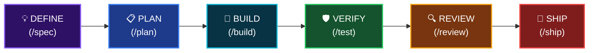

<div align="center">


# Antigravity Awesome Workspace

### La plantilla definitiva de Vibe Code impulsada por IA

**51 Agentes IA · 79 Comandos Slash · 26 Habilidades Core · 1500+ Biblioteca · 25 Servidores MCP**

Idioma: [English](README.md) | [Tiếng Việt](README_VI.md) | [简体中文](README_CN.md) | **Español**

[](LICENSE)
[](https://python.org/)

</div>

---

> **Consolidación de los 4 mejores sistemas de Vibe Code del mundo** en una sola plantilla lista para producción. Ejecuta `python init_vibe_project.py my-app` y obtendrás todo.

## 🎯 ¿Qué es esto?

La **plantilla de workspace de codificación agéntica con IA más completa**: un andamiaje listo para producción con todo lo que necesitas para construir software con agentes de codificación de IA.

Un comando. Todos los IDEs. Todas las habilidades. Sin bloqueo de proveedor.

```bash
python init_vibe_project.py my-app
# → 26 core skills, 51 agents, 79 commands, 25 MCP servers, Docker, CI/CD, OpenSpec... hecho.
```

---

## 📚 Referencias e Inspiración

Esta plantilla está inspirada y hace referencia a estos destacados proyectos de código abierto en la comunidad de codificación de IA:

<table>
<tr>
<td align="center" width="120">
<a href="https://github.com/AffaanMustafa/everything-claude-code">

</a>
</td>
<td>

**[Everything Claude Code](https://github.com/AffaanMustafa/everything-claude-code)** — El sistema de optimización de rendimiento para agentes de IA. 47 agentes, 181 habilidades, 79 comandos, hooks, configuraciones MCP. Ganador del Anthropic Hackathon.

</td>
</tr>
<tr>
<td align="center" width="120">
<a href="https://github.com/addyosmani/agent-skills">

</a>
</td>
<td>

**[Agent Skills](https://github.com/addyosmani/agent-skills)** — Habilidades de ingeniería de grado de producción por Addy Osmani (Google). Filosofía de "Proceso sobre Prosa", habilidades mapeadas al ciclo de vida, patrones de orquestación.

</td>
</tr>
<tr>
<td align="center" width="120">
<a href="https://github.com/forrestchang/andrej-karpathy-skills">

</a>
</td>
<td>

**[Karpathy Skills](https://github.com/forrestchang/andrej-karpathy-skills)** — Pautas de comportamiento derivadas de las observaciones de Andrej Karpathy sobre los errores de codificación LLM: Piensa antes de codificar, la simplicidad primero, cambios quirúrgicos, ejecución orientada a objetivos.

</td>
</tr>
<tr>
<td align="center" width="120">
<a href="https://github.com/study8677/antigravity-workspace-template">

</a>
</td>
<td>

**[Antigravity Workspace Template](https://github.com/study8677/antigravity-workspace-template)** — Motor de conocimiento multiagente. Protocolo Swarm, marco OpenSpec.

</td>
</tr>
</table>

> Todos los proyectos referenciados están bajo licencia MIT o Apache 2.0. Este proyecto tiene licencia MIT.

---

### Ciclo de Desarrollo (Development Lifecycle)



---

## 🚀 Inicio rápido

```bash
# Clonar la plantilla
git clone https://github.com/your-org/antigravity-awesome-workspace-skill.git
cd antigravity-awesome-workspace-skill

# Crear un nuevo proyecto
python init_vibe_project.py mi-app-increible

# Luego
cd mi-app-increible
cp .env.example .env    # Completar las claves API
# ¡Abrir en IDE (Cursor / Windsurf / Claude Code / Antigravity) y comenzar!
```

---

## 📦 ¿Qué incluye?

### Marco central (`.agent/`)
- **28 archivos de reglas** para 15 lenguajes de programación
- **9 flujos de trabajo** paso a paso (planificación, revisión, diseño de BD, generación de pruebas, refactorización, lanzamiento, OpenSpec)
- **26 Habilidades Core** (TDD, Spec-Driven, Seguridad, CI/CD, Arquitectura, Karpathy Guidelines...)

### Agentes IA (51 personas especialistas)
- **Arquitectos**: `architect`, `planner`, `chief-of-staff`
- **Revisores de código**: 10 especialistas por lenguaje
- **Seguridad**: `security-auditor`, `security-reviewer`
- **Testing**: `test-engineer`, `tdd-guide`, `e2e-runner`
- **Constructores**: 8 resolvedores de errores de compilación
- **Rendimiento, SEO, Accesibilidad, Base de datos, IA/ML, Código abierto...**

### 79 Comandos Slash
| Categoría | Comandos |
|-----------|----------|
| Flujo principal | `/plan`, `/tdd`, `/code-review`, `/build-fix`, `/verify` |
| Testing | `/e2e`, `/test-coverage`, `/go-test`, `/rust-test` |
| Sesión | `/save-session`, `/resume-session`, `/checkpoint` |
| Aprendizaje | `/learn`, `/evolve`, `/skill-create` |
| Multi-modelo | `/multi-plan`, `/multi-execute`, `/orchestrate` |

### 25+ Servidores MCP
PostgreSQL, GitHub, Jira, Supabase, Playwright, Context7, Vercel, Railway, Cloudflare, ClickHouse, y más.

### Documentación (24 archivos)
Filosofía de arquitectura, protocolo Swarm, configuración cero, guía de seguridad (29KB), guías de configuración IDE, guía de desarrollo de habilidades.

### Infraestructura
Docker (Producción + Sandbox), GitHub Actions CI/CD, OpenSpec, Motor de memoria, soporte multi-IDE.

### Biblioteca de habilidades (1500+)
El directorio `skill_library/` contiene el catálogo completo. Copie según necesidad a `.agent/skills/`.

---

## 📄 Licencia

Licencia MIT — ver [LICENSE](LICENSE).

<div align="center">

**Made by [Hai-Dang Nguyen](https://nguyenhaidang.io.vn/)** · PhD Student, College of Engineering & Computer Science, [VinUniversity](https://vinuni.edu.vn/)

[](https://nguyenhaidang.io.vn/)
[](https://github.com/dangindev)

<sub>Si utilizas esta plantilla en tu proyecto, considera añadir esta insignia a tu README:</sub>

```markdown
[](https://github.com/dangindev/antigravity-awesome-workspace-skill)
```

</div>
