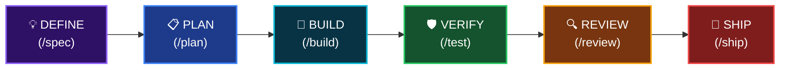

<div align="center">


# Antigravity Awesome Workspace

### La plantilla definitiva de Vibe Code impulsada por IA

**51 Agentes IA · 79 Comandos Slash · 26 Habilidades Core · 1500+ Biblioteca · 25 Servidores MCP**

Idioma: [English](README.md) | [Tiếng Việt](README_VI.md) | [简体中文](README_CN.md) | **Español**

[](LICENSE)
[](https://python.org/)

<br/>


</div>

---

> **Consolidación de los 4 mejores sistemas de Vibe Code del mundo** en una sola plantilla lista para producción. Ejecuta `python init_vibe_project.py my-app` y obtendrás todo al instante.

<br/>

## 🎯 ¿Qué es esto?

La **plantilla de workspace de codificación agéntica con IA más completa**: un andamiaje listo para producción con todo lo que necesitas para construir software con agentes de codificación de IA.

Un comando. Todos los IDEs. Todas las habilidades. Sin bloqueo de proveedor (Zero lock-in).

```bash
python init_vibe_project.py my-app
# → 26 core skills, 51 agents, 79 commands, 25 MCP servers, Docker, CI/CD, OpenSpec... hecho.
```

---

## 🚀 Inicio rápido

### Opción A — Crear un proyecto nuevo (Recomendado)

```bash
# Clonar esta plantilla
git clone https://github.com/your-org/antigravity-awesome-workspace-skill.git
cd antigravity-awesome-workspace-skill

# Inicializar proyecto con toda la suite Vibe Code
python init_vibe_project.py mi-app-increible
```

```
🚀 Initializing Ultimate Vibe Code Workspace at: /path/to/mi-app-increible

[*] Copied directory .antigravity/
[*] Copied directory .agent/
[*] Copied directory agents/
[*] Copied directory commands/
...
[+] 🎉 Project initialized successfully!

=================================================================
💡 NEXT STEPS:
  1. cd mi-app-increible
  2. cp .env.example .env  (then fill in your API keys)
  3. Open in Cursor / Windsurf / Claude Code / Antigravity
  4. Pre-installed components:
     ✅ 26 Core Skills + 1500+ in Skill Library
     ✅ 51 AI Personas (Architect, Reviewer, Security, QA...)
     ✅ 79 Slash Commands (/plan, /tdd, /code-review, /ship...)
     ✅ 25+ MCP Servers (DB, GitHub, Jira, Playwright, Vercel...)
     ✅ Karpathy Guidelines (Think → Simplify → Surgical → Goal-Driven)
     ...
=================================================================
```

### Opción B — Añadir a un proyecto existente

Copiar directorios específicos a tu proyecto:

```bash
# Copiar solo el marco de habilidades core
cp -r .agent/ /tu-proyecto/.agent/
cp AGENTS.md /tu-proyecto/
cp .cursorrules /tu-proyecto/

# O copiar todo
cp -r agents/ commands/ hooks/ references/ /tu-proyecto/
```

---

## 📐 Arquitectura

<div align="center">

</div>

### Ciclo de Desarrollo (Development Lifecycle)



Cada fase tiene **habilidades, agentes y comandos dedicados** que se activan automáticamente.

---

## 📦 ¿Qué incluye?

### 🤖 Agentes IA (51 Personas)

Personas especialistas que desempeñan un único rol con una perspectiva singular. Cada agente es descubierto automáticamente por tu IDE.

| Categoría | Agentes | Propósito |
|----------|--------|---------|
| **Arquitectura** | `architect`, `planner`, `chief-of-staff` | Diseño de sistemas, planificación, coordinación |
| **Revisión de Código** | `code-reviewer`, `typescript-reviewer`, `python-reviewer`, `go-reviewer`, `rust-reviewer`, `kotlin-reviewer`, `java-reviewer`, `csharp-reviewer`, `cpp-reviewer`, `flutter-reviewer` | Revisión de código específica del lenguaje |
| **Seguridad** | `security-auditor`, `security-reviewer`, `healthcare-reviewer` | Detección de vulnerabilidades, cumplimiento HIPAA |
| **Testing** | `test-engineer`, `tdd-guide`, `e2e-runner`, `pr-test-analyzer` | Estrategia de pruebas, cobertura, pruebas E2E |
| **Constructores (Build)** | `build-error-resolver`, `go-build-resolver`, `rust-build-resolver`, `kotlin-build-resolver`, `cpp-build-resolver`, `java-build-resolver`, `dart-build-resolver`, `pytorch-build-resolver` | Corrección automática de errores de compilación |
| **Rendimiento** | `performance-optimizer`, `harness-optimizer` | Análisis y optimización de rendimiento |
| **Documentación** | `doc-updater`, `docs-lookup`, `seo-specialist` | Redacción de docs, búsqueda de API, SEO |
| **AI/ML** | `gan-planner`, `gan-generator`, `gan-evaluator` | Arquitectura y entrenamiento GAN |
| **Código Abierto** | `opensource-forker`, `opensource-packager`, `opensource-sanitizer` | Bifurcar, empaquetar, desinfectar software |
| **Análisis** | `code-architect`, `code-explorer`, `code-simplifier`, `comment-analyzer`, `conversation-analyzer`, `type-design-analyzer`, `silent-failure-hunter`, `refactor-cleaner` | Análisis profundo de código |
| **Operaciones** | `loop-operator`, `a11y-architect`, `database-reviewer` | Operaciones, accesibilidad (a11y), bases de datos |

---

## ⚡ Comandos Slash (Referencia rápida)

> 79 comandos slash. Escribe `/` en cualquier sesión para invocarlos.

| Categoría | Comandos |
|----------|----------|
| **Flujo Core** | `/plan`, `/tdd`, `/code-review`, `/build-fix`, `/verify`, `/quality-gate` |
| **Testing** | `/tdd`, `/e2e`, `/test-coverage`, `/go-test`, `/kotlin-test`, `/rust-test`, `/cpp-test`, `/flutter-test` |
| **Revisión de Código** | `/code-review`, `/python-review`, `/go-review`, `/kotlin-review`, `/rust-review`, `/cpp-review`, `/flutter-review` |
| **Corrección de Build** | `/build-fix`, `/go-build`, `/kotlin-build`, `/rust-build`, `/cpp-build`, `/gradle-build`, `/flutter-build` |
| **Planificación** | `/plan`, `/multi-plan`, `/multi-workflow`, `/multi-backend`, `/multi-frontend`, `/multi-execute`, `/orchestrate`, `/devfleet` |
| **Sesión** | `/save-session`, `/resume-session`, `/sessions`, `/checkpoint`, `/aside`, `/context-budget` |
| **Aprendizaje** | `/learn`, `/learn-eval`, `/evolve`, `/promote`, `/instinct-status`, `/instinct-export`, `/instinct-import`, `/skill-create`, `/skill-health`, `/rules-distill` |
| **Documentación** | `/docs`, `/update-docs`, `/update-codemaps` |
| **Automatización** | `/loop-start`, `/loop-status`, `/claw` |

📋 Referencia completa: [COMMANDS-QUICK-REF.md](COMMANDS-QUICK-REF.md)

---

## 🔌 Servidores MCP (25 Preconfigurados)

Dos archivos de configuración MCP para la máxima flexibilidad:

### `mcp_servers.json` — Infraestructura Básica
| Servidor | Propósito |
|--------|---------|
| **PostgreSQL** | Operaciones de base de datos |
| **GitHub** | PR, issues, repos |
| **Puppeteer** | Automatización del navegador |
| **GitNexus** | Análisis de grafos de código |

### `mcp-configs/mcp-servers.json` — Catálogo Extendido
| Servidor | Propósito |
|--------|---------|
| **Jira** | Seguimiento de issues |
| **Supabase** | DB + Autenticación |
| **Playwright** | Pruebas de navegador |
| **Context7** | Búsqueda de documentación en vivo |
| **Vercel** | Despliegues |
| **Railway** | Despliegues |
| **Cloudflare** | Docs, Workers, Observabilidad |
| **ClickHouse** | Consultas analíticas |
| **Exa Search** | Investigación web |
| **Memory** | Memoria persistente entre sesiones |
| **Sequential Thinking** | Razonamiento en cadena |
| **Magic UI** | Componentes de interfaz de usuario |

---

## 📖 Biblioteca de Habilidades (Skill Library - 1500+)

El directorio `skill_library/` contiene el **catálogo completo** de habilidades de todos los repositorios fuente. Estas NO se cargan por defecto — sirven como una biblioteca a demanda.

**Cómo usar:**

```bash
# Ver habilidades disponibles
ls skill_library/

# Copia la habilidad que necesites a tu proyecto
cp -r skill_library/some-skill/ my-project/.agent/skills/
```

**Las categorías incluyen:** DevOps, Machine Learning, Mobile (Flutter/React Native), Game Development (Unity/Unreal), CMS (WordPress/Shopify), Cloud (AWS/GCP/Azure), Blockchain/Web3, Data Science, y más de 50 áreas adicionales.

---

## 🛡️ Seguridad

Esta plantilla incluye una infraestructura de seguridad completa:

- **Security Auditor Agent** — Detección de vulnerabilidades OWASP
- **Security Checklist** — Lista de verificación de auditoría lista para producción
- **The Security Guide** — Documento técnico detallado (29KB) sobre seguridad de agentes IA
- **Docker Sandbox** — Entorno de ejecución aislado
- **`.env.example`** — Nunca codifiques tus secretos o contraseñas

📖 Lee más: [docs/the-security-guide.md](docs/the-security-guide.md)

---

## 🛠️ Elige tu herramienta (Choose Your Tool)

Esta plantilla es agnóstica al marco de trabajo. Una vez inicializada a través de `python init_vibe_project.py`, utiliza el mismo repositorio en la forma que tu IDE espera.

| Herramienta | Config Inyectada | Primer Uso |
| ---- | --------------- | --------- |
| **Claude Code** | `CLAUDE.md`, `.claude/` | `>> /plan help me plan a SaaS MVP` |
| **Cursor** | `.cursorrules`, `.cursor/rules/` | `@planner help me plan a SaaS MVP` |
| **Windsurf** | `.cursorrules`, `AGENTS.md` | `@planner help me plan a SaaS MVP` |
| **Gemini CLI** | `.gemini/GEMINI.md` | `Use planner to plan a SaaS MVP` |
| **Codex CLI** | `AGENTS.md` | `Use planner to plan a SaaS MVP` |
| **Antigravity** | `.agent/` | `Use @planner to plan a SaaS MVP` |
| **Kiro CLI** | `.kiro/` | `Use planner to plan a SaaS MVP` |
| **GitHub Copilot** | `AGENTS.md` | `Ask Copilot to use planner to plan a SaaS MVP` |
| **OpenCode** | `.opencode/` | `opencode run @planner help me plan a SaaS MVP` |

### Verifica la instalación (Verify the install)

```bash
test -d .agent/skills && echo "✅ Vibe Code Workspace initialized successfully!"
```

### Ejecuta tu primer comando (Run your first command)

```text
Usa el comando `/plan` o pide al agente `planner` que planifique un SaaS MVP.
```

---

## 📚 Referencias e Inspiración

Esta plantilla está inspirada y hace referencia a estos destacados proyectos de código abierto en la comunidad de codificación de IA:

<table>
<tr>
<td align="center" width="120">
<a href="https://github.com/affaan-m/everything-claude-code">

</a>
</td>
<td>

**[Everything Claude Code](https://github.com/affaan-m/everything-claude-code)** — El sistema de optimización de rendimiento para agentes de IA. 47 agentes, 181 habilidades, 79 comandos, hooks, configuraciones MCP. Ganador del Anthropic Hackathon.

</td>
</tr>
<tr>
<td align="center" width="120">
<a href="https://github.com/addyosmani/agent-skills">

</a>
</td>
<td>

**[Agent Skills](https://github.com/addyosmani/agent-skills)** — Habilidades de ingeniería de grado de producción por Addy Osmani (Google). Filosofía de "Proceso sobre Prosa", habilidades mapeadas al ciclo de vida, patrones de orquestación.

</td>
</tr>
<tr>
<td align="center" width="120">
<a href="https://github.com/forrestchang/andrej-karpathy-skills">

</a>
</td>
<td>

**[Karpathy Skills](https://github.com/forrestchang/andrej-karpathy-skills)** — Pautas de comportamiento derivadas de las observaciones de Andrej Karpathy sobre los errores de codificación LLM: Piensa antes de codificar, la simplicidad primero, cambios quirúrgicos, ejecución orientada a objetivos.

</td>
</tr>
<tr>
<td align="center" width="120">
<a href="https://github.com/study8677/antigravity-workspace-template">

</a>
</td>
<td>

**[Antigravity Workspace Template](https://github.com/study8677/antigravity-workspace-template)** — Motor de conocimiento multiagente. Protocolo Swarm, marco OpenSpec.

</td>
</tr>
</table>

> Todos los proyectos referenciados están bajo licencia MIT o Apache 2.0. Este proyecto tiene licencia MIT.

---

## 🤝 Contribuir

¡Aceptamos contribuciones! Aquí le indicamos cómo participar:

1. Haz un **Fork** de este repositorio
2. **Crea** tu rama de funcionalidad (`git checkout -b feature/amazing-skill`)
3. **Añade** tu habilidad a `.agent/skills/` o a `skill_library/`
4. **Sigue** la [Guía de Desarrollo de Habilidades](docs/SKILL-DEVELOPMENT-GUIDE.md)
5. **Envía** un Pull Request

---

## 📄 Licencia

Este proyecto se encuentra bajo la **Licencia MIT**. Consulta el archivo [LICENSE](LICENSE) para más detalles.

Todos los componentes integrados conservan sus licencias MIT originales de sus respectivos repositorios.

---

<div align="center">

**Made by [Hai-Dang Nguyen](https://nguyenhaidang.io.vn/)** · PhD Student, College of Engineering & Computer Science, [VinUniversity](https://vinuni.edu.vn/)

[](https://nguyenhaidang.io.vn/)
[](https://github.com/dangindev)

<sub>Si utilizas esta plantilla en tu proyecto, considera añadir esta insignia a tu README:</sub>

```markdown
[](https://github.com/dangindev/antigravity-awesome-workspace-skill)
```

<br/>

[](https://github.com/dangindev/antigravity-awesome-workspace-skill)

</div>
