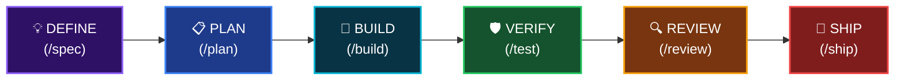

<div align="center">


# Antigravity Awesome Workspace

### Mẫu Vibe Code Tối Thượng dành cho Lập trình viên AI

**51 AI Agents · 79 Slash Commands · 26 Core Skills · 1500+ Kho Kỹ năng · 25 MCP Servers**

Ngôn ngữ: [English](README.md) | **Tiếng Việt** | [简体中文](README_CN.md) | [Español](README_ES.md)

[](LICENSE)
[](https://python.org/)

</div>

---

> **Hội tụ tinh hoa từ 4 hệ thống Vibe Code hàng đầu thế giới** vào một template duy nhất. Chỉ cần chạy `python init_vibe_project.py my-app` và bạn có tất cả.

## 🎯 Đây là gì?

**Mẫu workspace AI Agentic Coding toàn diện nhất** — một bộ khung sản xuất hoàn chỉnh cung cấp mọi thứ bạn cần để xây dựng phần mềm với AI Agents.

Một câu lệnh duy nhất. Mọi IDE. Tất cả kỹ năng. Không bị giới hạn.

```bash
python init_vibe_project.py my-app
# → 26 core skills, 51 agents, 79 commands, 25 MCP servers, Docker, CI/CD, OpenSpec... hoàn tất.
```

---

## 📚 Tham khảo & Nguồn cảm hứng

Template này được truyền cảm hứng và tham khảo từ các dự án mã nguồn mở xuất sắc trong cộng đồng AI coding:

<table>
<tr>
<td align="center" width="120">
<a href="https://github.com/AffaanMustafa/everything-claude-code">

</a>
</td>
<td>

**[Everything Claude Code](https://github.com/AffaanMustafa/everything-claude-code)** — Hệ thống tối ưu hiệu suất cho AI agent. 47 agents, 181 skills, 79 commands, hooks, MCP configs. Quán quân Anthropic Hackathon.

</td>
</tr>
<tr>
<td align="center" width="120">
<a href="https://github.com/addyosmani/agent-skills">

</a>
</td>
<td>

**[Agent Skills](https://github.com/addyosmani/agent-skills)** — Kỹ năng kỹ thuật chuẩn sản xuất bởi Addy Osmani (Google). Triết lý "Process over Prose", quy trình lifecycle, orchestration patterns.

</td>
</tr>
<tr>
<td align="center" width="120">
<a href="https://github.com/forrestchang/andrej-karpathy-skills">

</a>
</td>
<td>

**[Karpathy Skills](https://github.com/forrestchang/andrej-karpathy-skills)** — Nguyên tắc hành vi dựa trên quan sát của Andrej Karpathy về lỗi của LLM: Think Before Coding, Simplicity First, Surgical Changes, Goal-Driven Execution.

</td>
</tr>
<tr>
<td align="center" width="120">
<a href="https://github.com/study8677/antigravity-workspace-template">

</a>
</td>
<td>

**[Antigravity Workspace Template](https://github.com/study8677/antigravity-workspace-template)** — Engine tri thức đa tác tử. Swarm protocol, OpenSpec framework.

</td>
</tr>
</table>

> Tất cả dự án được tham khảo đều thuộc giấy phép MIT hoặc Apache 2.0. Dự án này thuộc giấy phép MIT.

---

### Quy trình phát triển (Development Lifecycle)



---

## 🚀 Bắt đầu nhanh

```bash
# Clone template
git clone https://github.com/your-org/antigravity-awesome-workspace-skill.git
cd antigravity-awesome-workspace-skill

# Tạo dự án mới với đầy đủ Vibe Code
python init_vibe_project.py ten-du-an-cua-ban

# Sau đó
cd ten-du-an-cua-ban
cp .env.example .env    # Điền API keys
# Mở IDE (Cursor / Windsurf / Claude Code / Antigravity) và bắt đầu!
```

---

## 📦 Bao gồm những gì?

### Khung cốt lõi (`.agent/`)
- **28 file luật** cho 15 ngôn ngữ (TypeScript, Python, Go, Rust, Kotlin, Java, C#, C++, Dart, Swift, PHP, Perl...)
- **9 workflow** step-by-step (lên kế hoạch, review, thiết kế DB, sinh test, refactor, release, OpenSpec)
- **26 Core Skills** (TDD, Spec-Driven, Security, CI/CD, Architecture, Karpathy Guidelines...)

### AI Agents (51 chuyên gia)
- **Kiến trúc sư**: `architect`, `planner`, `chief-of-staff`
- **Code Reviewer**: 10 chuyên gia cho từng ngôn ngữ (TS, Python, Go, Rust, Kotlin, Java, C#, C++, Flutter)
- **Bảo mật**: `security-auditor`, `security-reviewer`, `healthcare-reviewer`
- **Testing**: `test-engineer`, `tdd-guide`, `e2e-runner`
- **Build Fixer**: 8 chuyên gia sửa lỗi build cho từng ngôn ngữ
- **Performance, SEO, Accessibility, Database, AI/ML, Open Source...**

### 79 Slash Commands
- **Quy trình chính**: `/plan`, `/tdd`, `/code-review`, `/build-fix`, `/verify`
- **Testing**: `/e2e`, `/test-coverage`, `/go-test`, `/rust-test`, `/kotlin-test`...
- **Session**: `/save-session`, `/resume-session`, `/checkpoint`
- **Học tập**: `/learn`, `/evolve`, `/skill-create`
- **Đa mô hình**: `/multi-plan`, `/multi-execute`, `/orchestrate`

### 25+ MCP Servers
PostgreSQL, GitHub, Jira, Supabase, Playwright, Context7, Vercel, Railway, Cloudflare, ClickHouse, Exa Search, Memory, Sequential Thinking, Magic UI, fal.ai, DevFleet, Confluence...

### Tài liệu (24 files)
- Triết lý kiến trúc, Swarm Protocol, Zero Config
- Hướng dẫn bảo mật toàn diện (29KB)
- Hướng dẫn cài đặt cho mọi IDE
- Hướng dẫn phát triển Skill

### Hạ tầng
- Docker (Production + Sandbox)
- GitHub Actions CI/CD
- OpenSpec (Spec-Driven Development)
- Memory Engine
- Hỗ trợ đa IDE: Antigravity, Claude Code, Cursor, Gemini, Kiro, Codex

### Kho tàng Kỹ năng (1500+)
Thư mục `skill_library/` chứa toàn bộ skills. Khi cần kỹ năng chuyên biệt, copy vào `.agent/skills/`.

---

## 📋 Tham khảo đầy đủ

| Tài liệu | Nội dung |
|-----------|----------|
| [COMMANDS-QUICK-REF.md](COMMANDS-QUICK-REF.md) | Bảng tra cứu 79 commands |
| [SOUL.md](SOUL.md) | Nguyên tắc cốt lõi |
| [TROUBLESHOOTING.md](TROUBLESHOOTING.md) | Xử lý sự cố |
| [docs/ANTIGRAVITY-GUIDE.md](docs/ANTIGRAVITY-GUIDE.md) | Hướng dẫn Antigravity IDE |
| [docs/the-security-guide.md](docs/the-security-guide.md) | Hướng dẫn bảo mật |

---

## 📄 Giấy phép

MIT License — xem [LICENSE](LICENSE).

<div align="center">

**Made by [Hai-Dang Nguyen](https://nguyenhaidang.io.vn/)** · PhD Student, College of Engineering & Computer Science, [VinUniversity](https://vinuni.edu.vn/)

[](https://nguyenhaidang.io.vn/)
[](https://github.com/dangindev)

<sub>Nếu bạn dùng template này trong dự án của bạn, có thể thêm badge sau vào README:</sub>

```markdown
[](https://github.com/dangindev/antigravity-awesome-workspace-skill)
```

</div>
