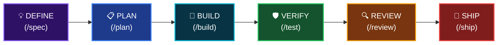

<div align="center">


# Antigravity Awesome Workspace

### Mẫu Vibe Code Tối Thượng dành cho Lập trình viên AI

**51 AI Agents · 79 Slash Commands · 26 Core Skills · 1500+ Kho Kỹ năng · 25 MCP Servers**

Ngôn ngữ: [English](README.md) | **Tiếng Việt** | [简体中文](README_CN.md) | [Español](README_ES.md)

[](LICENSE)
[](https://python.org/)

<br/>


</div>

---

> **Hội tụ từ 4 hệ thống Vibe Code hàng đầu thế giới** vào một workspace template duy nhất, sẵn sàng cho môi trường production. Chỉ cần một lệnh `python init_vibe_project.py my-app` và bạn có tất cả.

<br/>

## 🎯 Đây là gì?

**Mẫu workspace AI Agentic Coding toàn diện nhất** — một bộ khung hoàn chỉnh cung cấp mọi thứ bạn cần để xây dựng phần mềm với AI Agents.

Một câu lệnh duy nhất. Mọi IDE. Tất cả kỹ năng. Không bị giới hạn (Zero lock-in).

```bash
npx antigravity-awesome-workspace-skill my-app
# → 26 core skills, 51 agents, 79 commands, 25 MCP servers, Docker, CI/CD, OpenSpec... hoàn tất.
```

---

## 🚀 Bắt đầu nhanh

### Cách A — Tạo dự án mới (Khuyên dùng)

```bash
# Khởi tạo dự án với bộ công cụ Vibe Code đầy đủ thông qua npx
npx antigravity-awesome-workspace-skill my-awesome-app
```

```
🚀 Initializing Ultimate Vibe Code Workspace at: /path/to/my-awesome-app

[*] Copied directory .antigravity/
[*] Copied directory .agent/
[*] Copied directory agents/
[*] Copied directory commands/
...
[+] 🎉 Project initialized successfully!

=================================================================
💡 NEXT STEPS:
  1. cd my-awesome-app
  2. cp .env.example .env  (then fill in your API keys)
  3. Open in Cursor / Windsurf / Claude Code / Antigravity
  4. Pre-installed components:
     ✅ 26 Core Skills + 1500+ in Skill Library
     ✅ 51 AI Personas (Architect, Reviewer, Security, QA...)
     ✅ 79 Slash Commands (/plan, /tdd, /code-review, /ship...)
     ✅ 25+ MCP Servers (DB, GitHub, Jira, Playwright, Vercel...)
     ✅ Karpathy Guidelines (Think → Simplify → Surgical → Goal-Driven)
     ...
=================================================================
```

### Cách B — Thêm vào dự án có sẵn

Copy các thư mục cụ thể vào dự án của bạn:

```bash
# Chỉ copy bộ khung kỹ năng cốt lõi
cp -r .agent/ /your-project/.agent/
cp AGENTS.md /your-project/
cp .cursorrules /your-project/

# Hoặc copy toàn bộ
cp -r agents/ commands/ hooks/ references/ /your-project/
```

---

## 📐 Kiến trúc

<div align="center">

</div>

### Quy trình phát triển (Development Lifecycle)



Mỗi giai đoạn đều có **skills, agents, và commands chuyên biệt** tự động kích hoạt.

---

## 📦 Bao gồm những gì?

### 🤖 AI Agents (51 Personas)

Các chuyên gia (personas) đóng vai trò duy nhất với góc nhìn chuyên biệt. Mỗi agent sẽ tự động được IDE của bạn nhận diện.

| Thể loại | Agents | Mục đích |
|----------|--------|---------|
| **Kiến trúc** | `architect`, `planner`, `chief-of-staff` | Thiết kế hệ thống, lên kế hoạch, điều phối |
| **Review Code** | `code-reviewer`, `typescript-reviewer`, `python-reviewer`, `go-reviewer`, `rust-reviewer`, `kotlin-reviewer`, `java-reviewer`, `csharp-reviewer`, `cpp-reviewer`, `flutter-reviewer` | Review code theo từng ngôn ngữ |
| **Bảo mật** | `security-auditor`, `security-reviewer`, `healthcare-reviewer` | Phát hiện lỗ hổng OWASP, tuân thủ HIPAA |
| **Testing** | `test-engineer`, `tdd-guide`, `e2e-runner`, `pr-test-analyzer` | Chiến lược test, độ phủ, E2E |
| **Build Fixers** | `build-error-resolver`, `go-build-resolver`, `rust-build-resolver`, `kotlin-build-resolver`, `cpp-build-resolver`, `java-build-resolver`, `dart-build-resolver`, `pytorch-build-resolver` | Tự động sửa lỗi build theo ngôn ngữ |
| **Hiệu suất** | `performance-optimizer`, `harness-optimizer` | Phân tích & tối ưu hiệu suất |
| **Tài liệu** | `doc-updater`, `docs-lookup`, `seo-specialist` | Viết docs, tra cứu API, SEO |
| **AI/ML** | `gan-planner`, `gan-generator`, `gan-evaluator` | Kiến trúc & huấn luyện GAN |
| **Mã nguồn mở** | `opensource-forker`, `opensource-packager`, `opensource-sanitizer` | Fork, đóng gói, làm sạch OSS |
| **Phân tích** | `code-architect`, `code-explorer`, `code-simplifier`, `comment-analyzer`, `conversation-analyzer`, `type-design-analyzer`, `silent-failure-hunter`, `refactor-cleaner` | Phân tích code chuyên sâu |
| **Vận hành** | `loop-operator`, `a11y-architect`, `database-reviewer` | Vận hành, accessibility (a11y), DB |

---

## ⚡ Bảng lệnh nhanh (Commands)

> Tổng cộng 79 slash commands. Gõ `/` trong bất kỳ phiên chat nào để gọi lệnh.

| Thể loại | Lệnh (Commands) |
|----------|----------|
| **Luồng cốt lõi** | `/plan`, `/tdd`, `/code-review`, `/build-fix`, `/verify`, `/quality-gate` |
| **Testing** | `/tdd`, `/e2e`, `/test-coverage`, `/go-test`, `/kotlin-test`, `/rust-test`, `/cpp-test`, `/flutter-test` |
| **Review Code** | `/code-review`, `/python-review`, `/go-review`, `/kotlin-review`, `/rust-review`, `/cpp-review`, `/flutter-review` |
| **Sửa lỗi Build** | `/build-fix`, `/go-build`, `/kotlin-build`, `/rust-build`, `/cpp-build`, `/gradle-build`, `/flutter-build` |
| **Lên kế hoạch** | `/plan`, `/multi-plan`, `/multi-workflow`, `/multi-backend`, `/multi-frontend`, `/multi-execute`, `/orchestrate`, `/devfleet` |
| **Phiên làm việc** | `/save-session`, `/resume-session`, `/sessions`, `/checkpoint`, `/aside`, `/context-budget` |
| **Học tập** | `/learn`, `/learn-eval`, `/evolve`, `/promote`, `/instinct-status`, `/instinct-export`, `/instinct-import`, `/skill-create`, `/skill-health`, `/rules-distill` |
| **Tài liệu** | `/docs`, `/update-docs`, `/update-codemaps` |
| **Tự động hóa** | `/loop-start`, `/loop-status`, `/claw` |

📋 Tham khảo đầy đủ: [COMMANDS-QUICK-REF.md](COMMANDS-QUICK-REF.md)

---

## 🔌 Máy chủ MCP (25 Cấu hình sẵn)

Hai file cấu hình MCP mang lại sự linh hoạt tối đa:

### `mcp_servers.json` — Hạ tầng lõi
| Server | Mục đích |
|--------|---------|
| **PostgreSQL** | Thao tác cơ sở dữ liệu |
| **GitHub** | PR, issues, repos |
| **Puppeteer** | Tự động hóa trình duyệt |
| **GitNexus** | Phân tích đồ thị mã nguồn |

### `mcp-configs/mcp-servers.json` — Danh mục mở rộng
| Server | Mục đích |
|--------|---------|
| **Jira** | Theo dõi Issue |
| **Supabase** | DB + xác thực |
| **Playwright** | Browser testing |
| **Context7** | Tra cứu tài liệu trực tiếp |
| **Vercel** | Triển khai |
| **Railway** | Triển khai |
| **Cloudflare** | Docs, Workers, Observability |
| **ClickHouse** | Truy vấn Analytics |
| **Exa Search** | Nghiên cứu web |
| **Memory** | Bộ nhớ bền vững xuyên phiên |
| **Sequential Thinking** | Suy luận chuỗi (Chain-of-thought) |
| **Magic UI** | UI components |

---

## 📖 Kho Kỹ năng (Skill Library - 1500+)

Thư mục `skill_library/` chứa **toàn bộ danh mục kỹ năng** từ tất cả các repository nguồn. Các kỹ năng này KHÔNG được load mặc định — chúng đóng vai trò như một thư viện theo yêu cầu.

**Cách sử dụng:**

```bash
# Xem các kỹ năng có sẵn
ls skill_library/

# Copy kỹ năng bạn cần vào dự án của bạn
cp -r skill_library/some-skill/ my-project/.agent/skills/
```

**Các danh mục bao gồm:** DevOps, Machine Learning, Mobile (Flutter/React Native), Game Development (Unity/Unreal), CMS (WordPress/Shopify), Cloud (AWS/GCP/Azure), Blockchain/Web3, Data Science, và hơn 50 lĩnh vực khác.

---

## 🛡️ Bảo mật

Template này bao gồm hạ tầng bảo mật toàn diện:

- **Security Auditor Agent** — Phát hiện lỗ hổng OWASP
- **Security Checklist** — Danh sách kiểm tra bảo mật chuẩn production
- **The Security Guide** — Tài liệu chuyên sâu 29KB về bảo mật AI Agentic (CVEs, sandboxing, prompt injection)
- **Docker Sandbox** — Môi trường thực thi biệt lập
- **`.env.example`** — Tránh hardcode secret keys

📖 Đọc thêm: [docs/the-security-guide.md](docs/the-security-guide.md)

---

## 🛠️ Lựa chọn Công cụ (Choose Your Tool)

Template này không phụ thuộc vào nền tảng. Sử dụng bộ cài đặt npx với các flag để chỉ inject những cấu hình mà IDE của bạn hỗ trợ.

| Công cụ | Lệnh cài đặt | Lần sử dụng đầu tiên |
| ---- | --------------- | --------- |
| **Claude Code** | `npx antigravity-awesome-workspace-skill my-app --claude` | `>> /plan help me plan a SaaS MVP` |
| **Cursor** | `npx antigravity-awesome-workspace-skill my-app --cursor` | `@planner help me plan a SaaS MVP` |
| **Windsurf** | `npx antigravity-awesome-workspace-skill my-app --windsurf` | `@planner help me plan a SaaS MVP` |
| **Gemini CLI** | `npx antigravity-awesome-workspace-skill my-app --gemini` | `Use planner to plan a SaaS MVP` |
| **Codex CLI** | `npx antigravity-awesome-workspace-skill my-app --codex` | `Use planner to plan a SaaS MVP` |
| **Antigravity** | `npx antigravity-awesome-workspace-skill my-app --antigravity` | `Use @planner to plan a SaaS MVP` |
| **Kiro CLI** | `npx antigravity-awesome-workspace-skill my-app --kiro` | `Use planner to plan a SaaS MVP` |
| **OpenCode** | `npx antigravity-awesome-workspace-skill my-app --opencode` | `opencode run @planner help me plan a SaaS MVP` |
| **Tất cả công cụ** | `npx antigravity-awesome-workspace-skill my-app` | Hoạt động phổ quát cho tất cả các IDE |

### Xác minh cài đặt (Verify the install)

```bash
test -d .agent/skills && echo "✅ Vibe Code Workspace initialized successfully!"
```

### Chạy lệnh đầu tiên (Run your first command)

```text
Sử dụng lệnh `/plan` hoặc yêu cầu agent `planner` lên ý tưởng cho một SaaS MVP.
```

---

## 📚 Tham khảo & Nguồn cảm hứng

Template này được truyền cảm hứng và tham khảo từ các dự án mã nguồn mở xuất sắc trong cộng đồng AI coding:

<table>
<tr>
<td align="center" width="120">
<a href="https://github.com/affaan-m/everything-claude-code">

</a>
</td>
<td>

**[Everything Claude Code](https://github.com/affaan-m/everything-claude-code)** — Hệ thống tối ưu hiệu suất cho AI agent. 47 agents, 181 skills, 79 commands, hooks, MCP configs. Quán quân Anthropic Hackathon.

</td>
</tr>
<tr>
<td align="center" width="120">
<a href="https://github.com/addyosmani/agent-skills">

</a>
</td>
<td>

**[Agent Skills](https://github.com/addyosmani/agent-skills)** — Kỹ năng kỹ thuật chuẩn sản xuất bởi Addy Osmani (Google). Triết lý "Process over Prose", quy trình lifecycle, orchestration patterns.

</td>
</tr>
<tr>
<td align="center" width="120">
<a href="https://github.com/forrestchang/andrej-karpathy-skills">

</a>
</td>
<td>

**[Karpathy Skills](https://github.com/forrestchang/andrej-karpathy-skills)** — Nguyên tắc hành vi dựa trên quan sát của Andrej Karpathy về lỗi của LLM: Think Before Coding, Simplicity First, Surgical Changes, Goal-Driven Execution.

</td>
</tr>
<tr>
<td align="center" width="120">
<a href="https://github.com/study8677/antigravity-workspace-template">

</a>
</td>
<td>

**[Antigravity Workspace Template](https://github.com/study8677/antigravity-workspace-template)** — Engine tri thức đa tác tử. Swarm protocol, OpenSpec framework.

</td>
</tr>
</table>

> Tất cả dự án được tham khảo đều thuộc giấy phép MIT hoặc Apache 2.0. Dự án này thuộc giấy phép MIT.

---

## 🤝 Đóng góp

Chúng tôi rất hoan nghênh những đóng góp! Đây là cách để tham gia:

1. **Fork** repository này
2. **Create** nhánh feature của bạn (`git checkout -b feature/amazing-skill`)
3. **Add** kỹ năng của bạn vào `.agent/skills/` hoặc `skill_library/`
4. **Follow** [Skill Development Guide](docs/SKILL-DEVELOPMENT-GUIDE.md)
5. **Submit** một Pull Request

---

## 📄 Giấy phép

Dự án này được cấp phép theo **MIT License** — xem [LICENSE](LICENSE) để biết chi tiết.

Tất cả các thành phần được tích hợp giữ nguyên giấy phép MIT gốc từ repository tương ứng.

---

<div align="center">

**Made by [Hai-Dang Nguyen](https://nguyenhaidang.io.vn/)** · PhD Student, College of Engineering & Computer Science, [VinUniversity](https://vinuni.edu.vn/)

[](https://nguyenhaidang.io.vn/)
[](https://github.com/dangindev)

<sub>Nếu bạn dùng template này trong dự án của bạn, có thể thêm badge sau vào README:</sub>

```markdown
[](https://github.com/dangindev/antigravity-awesome-workspace-skill)
```

<br/>

[](https://github.com/dangindev/antigravity-awesome-workspace-skill)

</div>
